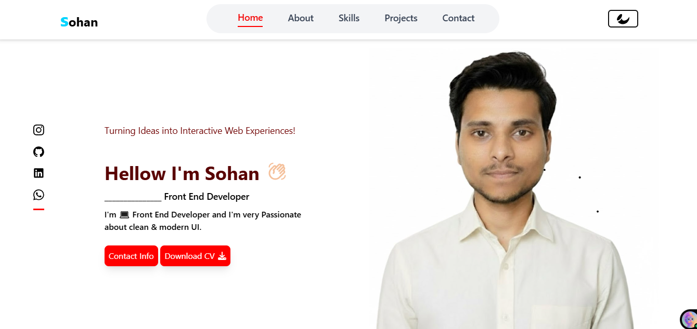
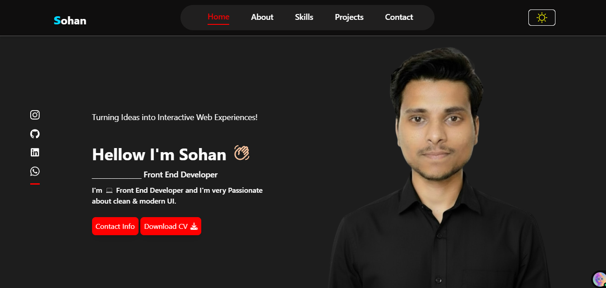
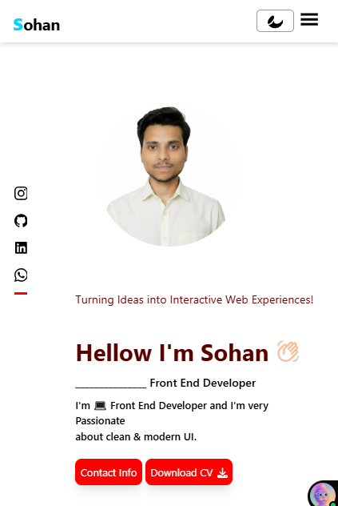

# Sohan Anuragi Portfolio

This is my **Frontend Developer Portfolio** built with **React, Vite, and Tailwind CSS**. It is fully responsive and includes a light/dark theme toggle.

## Live Demo
https://sohan-portfolio.vercel.app

## Sections
- Home – Intro with profile and social links
- About – About me
- Skills – My technical skills
- Projects – My projects showcase
- Contact – Contact form

## How to Run
1. Clone the repo: `git clone https://github.com/sohananuragi/sohan-portfolio.git`
2. Install dependencies: `npm install`
3. Start server: `npm run dev`

## Contact
Email: sohananuragi81@gmail.com  
LinkedIn: https://www.linkedin.com/in/sohananuragi/  
GitHub: https://github.com/sohananuragi

IMAGES OF PROJECT

  

